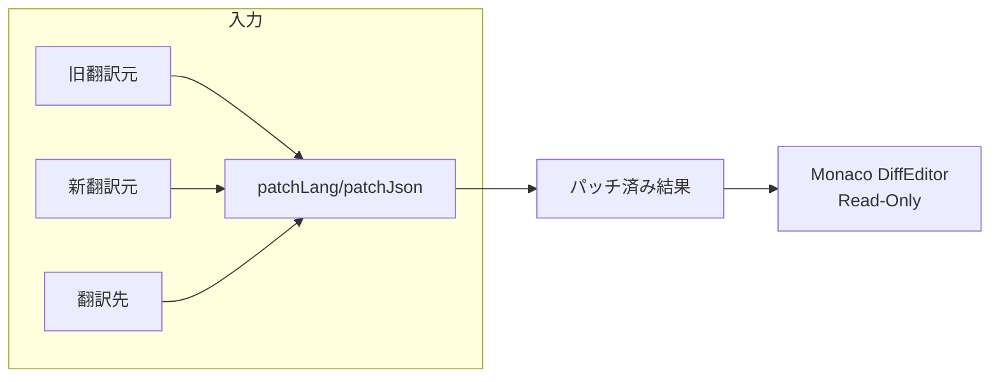
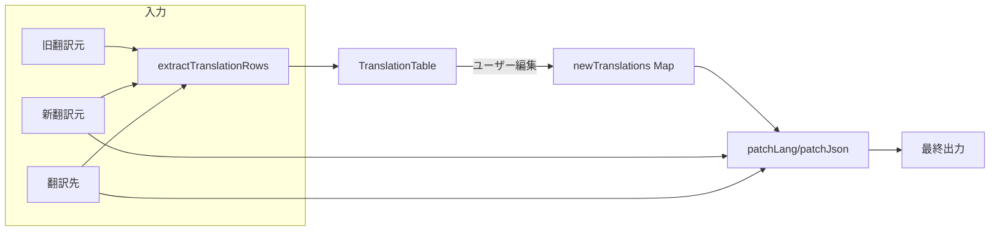

# 翻訳テーブルビュー機能の追加

## 概要

現在のMonacoベースの差分ビューアを拡張し、翻訳作業を完結できるテーブルビューを追加します。

**目標:**
- [キー, 旧原語の値, 新原語の値, 旧翻訳の値] をテーブル表示
- 変更/追加された行の翻訳を直接編集可能に
- 原語ファイルのフォーマット（空行、重複キーによるコメント）を保持

---

## 設計決定事項

- **ビュー切り替え**: ステータスバーにボタンを追加し、Diff View / Table View を切り替え
- **表示対象**: 全キーを表示、変更/追加キーをハイライト、フィルタトグル付き
- **編集**: 全キーに対して翻訳編集可能（5列目に新規翻訳入力欄）

---

## 現在のアーキテクチャ



## 提案するアーキテクチャ



---

## Proposed Changes

### 翻訳データ抽出ユーティリティ

#### [NEW] [extractTranslationRows.ts](file:///c:/Users/hello/WebstormProjects/translate-migrator-2/src/utils/extractTranslationRows.ts)

テーブル表示用のデータ構造を返す関数。

```typescript
export type TranslationRow = {
  key: string;
  oldSourceValue?: string; // 旧翻訳元の値
  newSourceValue: string;  // 新翻訳元の値
  targetValue?: string;    // 既存翻訳の値
  status: 'added' | 'changed' | 'unchanged';
};

export function extractTranslationRows(params: {
  oldSource?: string;
  source: string;
  target?: string;
  duplicatedKey: 'ignore' | 'first' | 'last' | 'pop';
}): TranslationRow[];
```

- 既存の [parseToPropertyMap](file:///c:/Users/hello/WebstormProjects/translate-migrator-2/src/utils/langPatch.ts#15-38) ロジックを再利用
- 配列順序を保持してパッチ時のフォーマット維持を保証

---

### テーブルコンポーネント

#### [NEW] [TranslationTable.tsx](file:///c:/Users/hello/WebstormProjects/translate-migrator-2/src/components/TranslationTable.tsx)

翻訳行を表示・編集するためのReactコンポーネント。

**機能:**
- 5列テーブル: キー | 旧原語 | 新原語 | 既存翻訳 | 新規翻訳入力
- 全キーに対して翻訳編集可能
- 変更(`changed`)/追加(`added`)行をハイライト
- 変更/追加のみ表示するフィルタトグル
- ダークモード対応

---

### 出力表示

#### [NEW] [PatchedOutput.tsx](file:///c:/Users/hello/WebstormProjects/translate-migrator-2/src/components/PatchedOutput.tsx)

テーブルビューの下部にパッチ済み結果を表示するMonacoエディタ。

**機能:**
- テーブルの下にスクロールで表示（画面占有ではない）
- 読み取り専用Monaco Editor
- パッチ済みJSON/langをリアルタイム表示
- コピー機能付き

---

### メインページの更新

#### [MODIFY] [page.tsx](file:///c:/Users/hello/WebstormProjects/translate-migrator-2/src/app/page.tsx)

- ビューモード切り替え用のstate追加 (`'diff' | 'table'`)
- **ステータスバーに切り替えボタンを追加**（ThemeToggleの横）
- `TranslationTable` コンポーネントの条件付きレンダリング
- 新規翻訳入力を管理するstate (`Map<string, string>`)
- パッチロジックを拡張して新規翻訳を組み込み

---

### スタイル

#### [MODIFY] [globals.css](file:///c:/Users/hello/WebstormProjects/translate-migrator-2/src/styles/globals.css)

テーブルコンポーネント用のスタイル追加:
- 行ステータスに応じた背景色（追加: 緑系、変更: 黄系）
- 入力フィールドのスタイル
- レスポンシブテーブルレイアウト

---

## Verification Plan

### 自動テスト

#### 既存テストの実行

```bash
pnpm test
```

現在 [src/utils/__tests__/langPatch.test.ts](file:///c:/Users/hello/WebstormProjects/translate-migrator-2/src/utils/__tests__/langPatch.test.ts) と [jsonPatch.test.ts](file:///c:/Users/hello/WebstormProjects/translate-migrator-2/src/utils/__tests__/jsonPatch.test.ts) でパッチロジックをカバー。

#### 新規テストの追加

[NEW] `src/utils/__tests__/extractTranslationRows.test.ts`:
- 追加キーの検出
- 変更キーの検出
- 重複キーの正しい処理
- コメント行の処理

---

### Manual Verification

1. **開発サーバー起動**: `pnpm dev` → http://localhost:3000
2. **テストデータ貼り付け**:
   - 旧翻訳元: 既存キーを持つサンプル
   - 新翻訳元: いくつかのキーを変更・追加
   - 翻訳先: 既存の翻訳

3. **テーブルビュー確認**:
   - [ ] 変更/追加キーのみ表示されていること
   - [ ] 旧原語・新原語・既存翻訳が正しく表示
   - [ ] 翻訳入力が動作すること

4. **出力確認**:
   - [ ] 元のフォーマット（空行、コメント）が保持されていること
   - [ ] 入力した翻訳が正しくパッチ結果に反映

---

## 実装順序

1. `extractTranslationRows.ts` + テスト作成
2. `TranslationTable.tsx` コンポーネント作成
3. [page.tsx](file:///c:/Users/hello/WebstormProjects/translate-migrator-2/src/app/page.tsx) にビュー切り替えとテーブル統合
4. スタイル調整
5. 検証・修正
